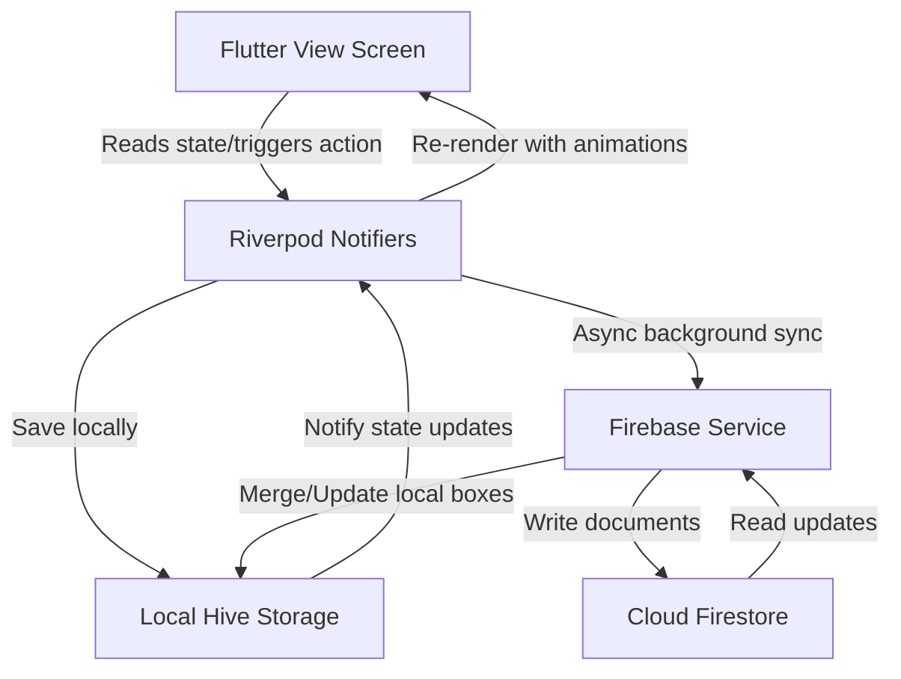

# Sabr Tasbih Project Documentation

Welcome to the **Sabr Tasbih** technical manual. This document details the application architecture, technology selection, folder structure, data synchronization, styling customization, preview guidelines, and troubleshooting.

---

## 🏗️ Architecture & Technology Choices

### 1. Technology Selection Details

| Technology | Purpose | Selected For | Alternatives Evaluated |
| :--- | :--- | :--- | :--- |
| **Flutter** | Frontend UI | True cross-platform compilation (Android, iOS, Web PWA, Desktop) from a single code base. Native rendering performance. | React Native (lower performance on canvas/renders), Kotlin Multiplatform (complex UI sync). |
| **Riverpod** | State Management & DI | Unidirectional data flow, compile-time safety, testability, and seamless separation of concerns. | Bloc (heavy boilerplate), Provider (less compile-time safety). |
| **Hive** | Local Database | Fast NoSQL key-value database built in pure Dart. Highly cross-platform and optimized for mobile/PWA. | Sqflite (no Web support), Shared Preferences (slow for large data maps). |
| **Firebase** | Cloud Sync & Auth | Fast Firestore document sync, anonymous/Google/Apple authentication handlers, and built-in Cloud Messaging. | Supabase (complex local-first offline syncing support), Custom Node.js/PostgreSQL backend (high cost). |
| **fl_chart** | Visual Graphs | Flutter-native charts with excellent animations and custom shapes for daily/weekly trends. | Custom Painter (high boilerplate). |

---

## 📁 Folder Structure

The project follows a modular, feature-oriented Clean Architecture pattern:

```text
lib/
├── app/             # Global configurations, routing, and app startup wrappers.
├── core/            # App-wide constants, errors, and utility classes.
├── config/          # Central configuration configs (Theme config, global constants).
├── services/        # Third-party integrations (Hive storage, Audio, Haptics, Notifications, Firebase).
├── shared/          # Global assets, shared models, repositories, and global widgets.
├── features/        # Modular feature screens and tabs (Counter, Duas, Garden, Stats, Settings).
│   └── tabs/        # Individual child widgets rendered inside the primary HomeScreen navigation.
├── models/          # Persistent data entities representing state (Dhikr, Dua, Garden, Streaks, Reminders).
├── providers/       # Riverpod StateNotifiers containing the app business logic.
├── theme/           # UI styling tokens, custom fonts, Light and Dark themes.
├── localization/    # Application translation delegates and JSON parser.
└── routes/          # Application named-route handlers.
```

---

## 🔄 Data Flow Map

The application implements an **Offline-First Repository Pattern** with background syncing:



---

## 🎨 How to Modify & Customize

### 1. Modifying Themes & Colors
*   **Location:** [app_theme.dart](file:///c:/Users/ksham/OneDrive/Desktop/tasbih/lib/theme/app_theme.dart)
*   To modify brand colors, update the static color tokens:
    *   `primaryEmerald`: Controls primary buttons, loaders, and progress rings.
    *   `accentGold`: Controls highlights, targets, and active streak flame icons.
    *   `lightBg` / `darkBg`: Controls background Scaffold canvases.

### 2. Customizing Typography
*   We use Google Fonts (Outfit for titles, Inter for body text, and Amiri for Arabic scriptures).
*   To change the fonts, edit the `textTheme` declarations in `AppTheme.lightTheme` and `AppTheme.darkTheme`.

### 3. Adding Duas
*   **Location:** [duas.json](file:///c:/Users/ksham/OneDrive/Desktop/tasbih/assets/data/duas/duas.json)
*   Simply append a new JSON object conforming to this schema:
    ```json
    {
      "id": "dua_unique_id",
      "title": "Dua Title",
      "arabic": "اللَّهُمَّ...",
      "transliteration": "Transliterated pronunciation",
      "translation": "Translated meaning",
      "category": "Morning Duas",
      "tags": ["morning", "protection"],
      "reference": "Source citation",
      "source": "Hisn al-Muslim"
    }
    ```

### 4. Adding Built-In Dhikr
*   **Location:** [built_in_dhikr.json](file:///c:/Users/ksham/OneDrive/Desktop/tasbih/assets/data/dhikr/built_in_dhikr.json)
*   Append items to seed the initial counter database on first startup.

### 5. Adjusting Translations
*   **Location:** `assets/translations/`
    *   [app_en.json](file:///c:/Users/ksham/OneDrive/Desktop/tasbih/assets/translations/app_en.json) (English)
    *   [app_ar.json](file:///c:/Users/ksham/OneDrive/Desktop/tasbih/assets/translations/app_ar.json) (Arabic)
    *   [app_ur.json](file:///c:/Users/ksham/OneDrive/Desktop/tasbih/assets/translations/app_ur.json) (Urdu)
*   Add key-value pairs matching localized translation IDs.

---

## 📱 How to Preview the Application

Execute these terminal commands from the root directory of the workspace:

1.  **Chrome Web Browser:**
    ```bash
    flutter run -d chrome
    ```
2.  **Android Emulator:**
    *   Ensure an Android Virtual Device (AVD) is running.
    ```bash
    flutter run -d emulator-5554
    ```
3.  **iOS Simulator:**
    *   Ensure Simulator app is running on macOS.
    ```bash
    flutter run -d iPhone
    ```
4.  **Desktop Preview:**
    *   On Windows: `flutter run -d windows`
    *   On macOS: `flutter run -d macos`
    *   On Linux: `flutter run -d linux`

---

## 🛠️ Troubleshooting Guide

### 1. Firebase Errors
*   **Problem:** App crashes or logs `Firebase has not been initialized`.
*   **Fix:** We have wrapped `Firebase.initializeApp` inside a try-catch statement. The application will log a failure but degrade gracefully to **Offline-First Mode** utilizing local Hive storage. Check your `google-services.json` (Android) or `GoogleService-Info.plist` (iOS) configuration files if you want remote syncing.

### 2. Notification Issues
*   **Problem:** Scheduled reminders do not show up on mobile devices.
*   **Fix:** On Android 13+ and iOS, users must explicitly grant permission. Call `NotificationService.init()` on app startup (handled in `main.dart`) to prompt the user. Also check power management options on Android which may block exact alarms.

### 3. Hive Errors
*   **Problem:** `HiveError: Box not found` or corrupted schema.
*   **Fix:** This occurs if you modify model properties without updating database keys. If this happens during development, clear the app data or invoke `_hiveService.clearAllBoxes()` to reset.

### 4. GitHub Pages / Web Deployment Issues
*   **Problem:** PWA shows a blank screen on GitHub Pages.
*   **Fix:** You must set the base href to match your repository name:
    ```bash
    flutter build web --base-href="/sabr-tasbih/"
    ```
    Also verify that your custom Service Worker paths in `sw.js` align with the repository subdirectory context.
